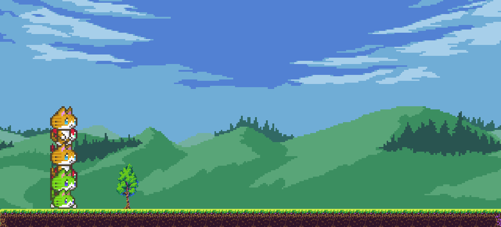

# Cat AI
Using the NEAT-Python module for a chrome dino-type game.

|  |  |
| --- | --- |
| Name | Cat AI |
| Made in | April 2022 |
| Language used | Python 3 |
| Libraries used | Pygame, NEAT-Python, random, math, os |
| Programs used | Pycharm, GIMP |

## How to use
You must have the modules `pygame` and `neat-python` installed in order to run this program.

While running, you'll see a window displaying the game being played by the computer. Note that in each end of a generation, the terminal will print `DEAD! {points}`, indicating that all the population has died, and showing how much far did the best individual get.

You can use your `spacebar` to shift between a normal speed, and a faster speed during the program's execution.

---

All code was made by me.

Midia found in [itch.io](itch.io)

Credits for the original artists.
